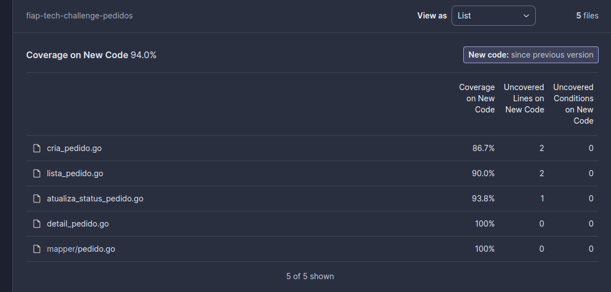

# fiap-tech-challenge-pedidos

### Tech Challenge 4:
### Passos para homologação dos professores da Fiap

1. Faça o login na plataforma da AWS;
2. Crie um repositório privado no ECR da AWS chamado fiap-tech-challenge-api-pedidos;
3. Acesse IAM->Usuários e crie um novo usuário chamado Github;
4. Com esse usuário criado, vá até a listagem de usuários e acesse os detalhes do mesmo;
5. No menu Permissões que irá aparecer na tela de detalhes, clique no botão "Adicionar permissões" que aparece no canto direito;
6. Na tela que irá aparecer, selecione a opção "Anexar políticas diretamente";
7. Pesquise pela permissão "AmazonEC2ContainerRegistryPowerUser" e adicione ela;
8. Voltando aos detalhes, no menu Permissões ainda, clique no botão "Adicionar permissões" que aparece no canto direito e selecione a opção "Criar política em linha";
9. No combo de serviços do formulário que será aberto, selecione a opção EC2, marque a opção "Todas as ações do EC2 (ec2:*)" que irá aparecer, e em Recursos marque a opção "Tudo", logo abaixo irá aparecer um botão "Adicionar mais permissões", clique nele e repita o mesmo processo que fez com o EC2 para os seguintes serviços: EKS, IAM e CloudWatch Logs;
10. Após avançar, defina um nome e clique em "Criar política";
11. Após isso, de volta a tela de detalhes do usuário, clique na aba "Credenciais de Segurança", e no bloco "Chaves de acesso", clique em "Criar chave de acesso";
12. Na tela que irá se abrir, selecione a opção "Command Line Interface (CLI)" e clique em próximo;
13. No valor da etiqueta, coloque o valor "github actions" ou qualquer um que prefira para identificar posteriormente;
14. Copie os valores dos campos "Chave de acesso" e "Chave de acesso secreta";
15. Na plataforma do Github, acesse o menu "Settings" do projeto, na tela que se abrir, clique no menu Security->Secrets and variables->Actions;
16. Adicione uma "repository secret" chamada AWS_ACCESS_KEY_ID com o valor copiado de "Chave de acesso", e crie outra "repository secret" chamada AWS_SECRET_ACCESS_KEY com o valor copiado de "Chave de acesso secreta";
17. Vincule este projeto no Sonar Cloud:
```
https://sonarcloud.io/
```
18. Acesse seu projeto no Sonar Cloud e vá até o menu Administration->Analisys Method e desmarque a opção "Automatic Analysis";
19. Depois vá até o menu Administration->Update Key e copie o valor de Project Key;
20. No menu Account que está no canto superior direito com a foto de seu usuário, acesse o menu My Organizations e copie o valor da Organization Key;
21. Depois novamente no menu Account, acesse My Account->Security e crie um novo token e copie o seu valor;
22. Retorne até o menu Settings do seu projeto do Github e cadastre novas "repository secret" conforme explicado abaixo:
```
SONAR_PROJECT_KEY=Valor copiado no passo 16
SONAR_ORGANIZATION=Valor copiado no passo 17
SONAR_TOKEN=Valor copiado no passo 18
```
23. Após isso qualquer commit neste repositório que for para a branch "main", irá subir uma imagem desta api no ECR da AWS;


### Evidência da cobertura dos testes unitários

